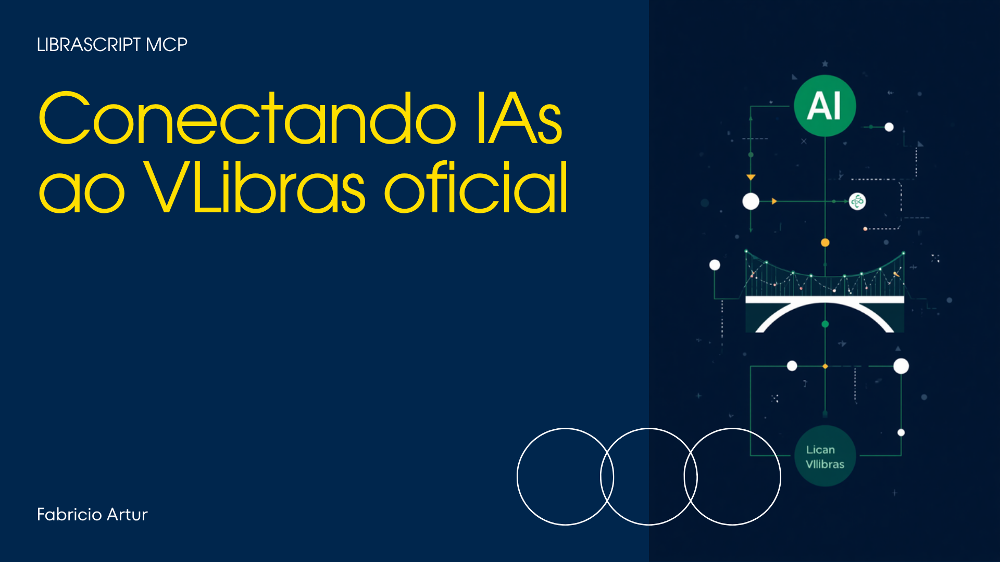
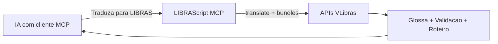
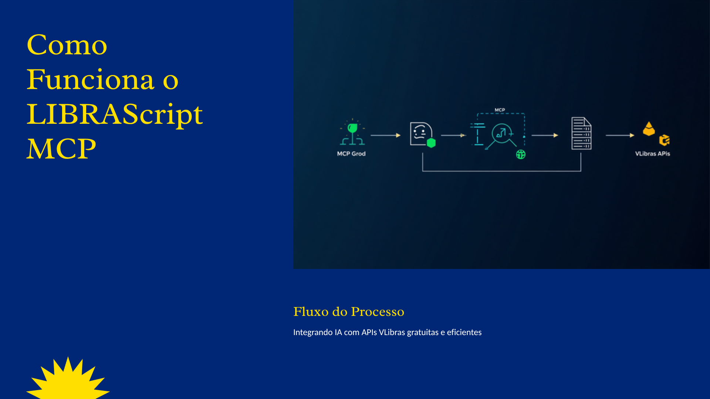
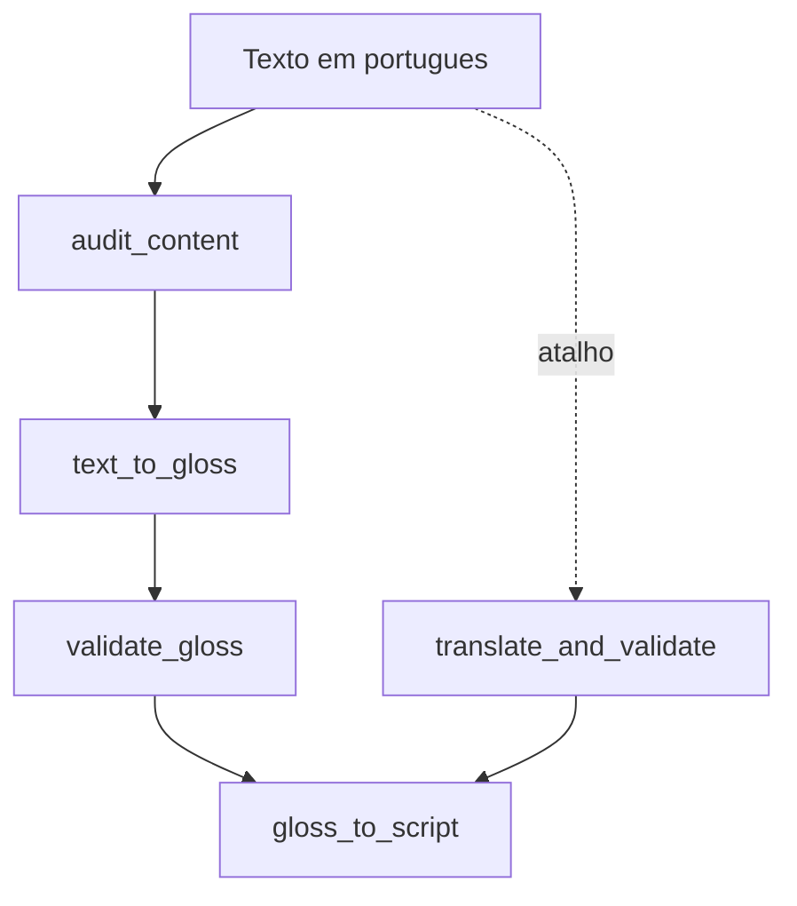
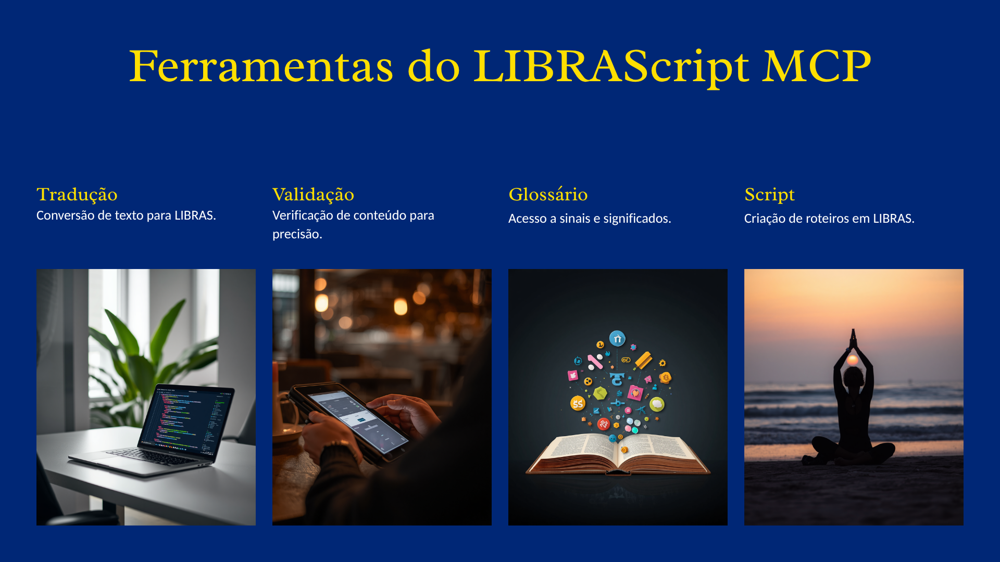
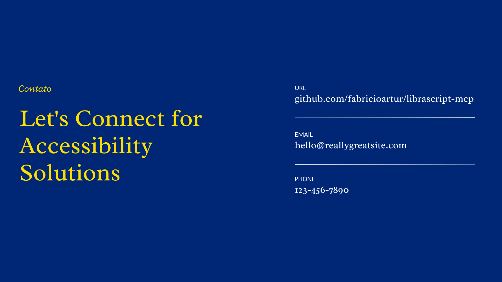

# LIBRAScript MCP

<p align="center">
  
</p>

<p align="center">
  <a href="https://github.com/fabricioartur/librascript-mcp"></a>
  <a href="https://github.com/fabricioartur/librascript-mcp/releases/tag/v0.3.0"></a>
  <a href="LICENSE"></a>
  
  
</p>

Torne qualquer IA capaz de **produzir conteúdo em LIBRAS** usando as APIs oficiais do [VLibras](https://www.gov.br/governodigital/pt-br/acessibilidade-e-usuario/vlibras) (Governo Digital).

Funciona com **Cursor, Grok, Claude Desktop, Claude Code** e qualquer ferramenta que suporte o [protocolo MCP](https://modelcontextprotocol.io).

---

## Comece em 3 minutos

### Opção A — clone do repositório (funciona hoje)

```bash
git clone https://github.com/fabricioartur/librascript-mcp.git
cd librascript-mcp
npm install
npm run build
npm run doctor
npm run demo
```

Texto personalizado na demo:

```bash
node dist/index.js --demo "Bem-vindo ao nosso curso de programação"
```

Configuração MCP local (edite o caminho absoluto): [`examples/mcp-local-dev.json`](examples/mcp-local-dev.json)

### Opção B — `npx` (após publicar no npm)

```bash
npx -y librascript-mcp --doctor
npx -y librascript-mcp --demo "Bem-vindo ao nosso curso de programação"
```

Configuração MCP:

```json
{
  "mcpServers": {
    "librascript": {
      "command": "npx",
      "args": ["-y", "librascript-mcp"]
    }
  }
}
```

Exemplos prontos: [`examples/mcp-cursor.json`](examples/mcp-cursor.json), [`examples/mcp-claude-desktop.json`](examples/mcp-claude-desktop.json)

### Onde colocar a config

| Ferramenta | Arquivo / local |
|------------|-----------------|
| **Cursor** | Configurações → MCP |
| **Grok Build** | Config MCP do projeto |
| **Claude Desktop** | `~/.config/claude/claude_desktop_config.json` (macOS/Linux) |

Reinicie o editor após salvar a config.

---

## O que pedir para a IA

Você não precisa saber os nomes das ferramentas. Basta escrever em português:

| Você escreve | A IA faz |
|--------------|----------|
| *"Traduza para LIBRAS: Bem-vindo ao curso"* | Traduz e valida |
| *"Este texto está bom para LIBRAS?"* | Audita antes de traduzir |
| *"Gere o roteiro em LIBRAS deste parágrafo"* | Traduz + roteiro com tempos |
| *"Traduza cada slide abaixo"* | Tradução em lote |

### Prompts prontos (se o seu cliente suportar)

- **traduzir-para-libras** — fluxo completo
- **tornar-site-acessivel** — audita README ou página web
- **traduzir-slides** — vários trechos de uma vez

---

## Como funciona



<p align="center">
  
</p>

| Etapa | O que acontece |
|-------|----------------|
| 1 | Você pede à IA em português natural |
| 2 | A IA chama o LIBRAScript MCP |
| 3 | O MCP consulta as APIs do VLibras |
| 4 | Retorna glossa validada e roteiro com tempos estimados |

**Exemplo real:**

| | |
|---|---|
| Entrada | `Bem-vindo ao nosso curso de programação` |
| Glossa | `BEM_VINDO NOSSO CURSO&ESTUDAR PROGRAMAÇÃO` |
| Validação | 100% dos sinais no dicionário oficial |

---

## O problema que resolve

<p align="center">
  
</p>

O VLibras traduz páginas para quem **consome** conteúdo (widget Ícaro). O LIBRAScript preenche a lacuna de quem **cria** conteúdo com IA — desenvolvedores, educadores, ONGs e criadores digitais.

---

## Ferramentas em ação



<p align="center">
  
</p>

### Referência das ferramentas

| Ferramenta | Para que serve |
|------------|----------------|
| `translate_and_validate` | **Comece por aqui** — audita, traduz e valida |
| `text_to_gloss` | Só traduzir |
| `validate_gloss` | Conferir qualidade da glossa |
| `audit_content` | Melhorar o texto em português antes de traduzir |
| `gloss_to_script` | Roteiro com tempos para vídeo/aula |
| `batch_translate` | Vários trechos (slides, FAQ…) |
| `lookup_sign` | Buscar sinal no dicionário |
| `submit_review` | Enviar feedback ao VLibras |
| `dictionary_stats` | Quantos sinais existem no dicionário |

---

## Apresentação visual

Deck de 5 slides + banner do README:

<p align="center">
  
</p>

| Formato | Link |
|---------|------|
| PDF | [librascript-mcp-deck.pdf](docs/deck/librascript-mcp-deck.pdf) |
| PowerPoint | [librascript-mcp-deck.pptx](docs/deck/librascript-mcp-deck.pptx) |
| Banner (Canva) | [Editar slide 1](https://www.canva.com/d/3oINlkfAXE3eMwF) |
| Deck completo (Canva) | [Editar 5 slides](https://www.canva.com/d/G3JXjOu8qwcWOmv) |
| Todas as imagens | [docs/images/](docs/images/) |

---

## Quem pode usar

| Funciona | Não funciona diretamente |
|----------|--------------------------|
| Cursor, Grok, Claude Desktop | ChatGPT no navegador (sem MCP) |
| Claude Code, VS Code + MCP | Apps sem suporte ao protocolo |

**Requisitos:** Node.js 18+, internet (APIs do governo).

**Custo:** R$ 0 — sem API key, sem cadastro.

---

## Aviso importante

> O VLibras **não substitui um intérprete humano** de LIBRAS.
>
> Este projeto ajuda a **preparar** conteúdo (glossas, roteiros, revisões). Para aulas, vídeos publicados, audiências ou materiais oficiais, sempre envolva um fluente em LIBRAS na revisão final.

[Fonte oficial](https://www.gov.br/governodigital/pt-br/acessibilidade-e-usuario/vlibras)

---

## Problemas comuns

| Problema | Solução |
|----------|---------|
| MCP não aparece | Reinicie o editor após salvar a config |
| `command not found: node` | Instale Node 18+ em [nodejs.org](https://nodejs.org) |
| `npx` retorna 404 | Pacote ainda não publicado — use Opção B (clone) |
| Erro de tradução | Rode `npm run doctor` — API do governo pode estar fora |
| Glossa com score baixo | Simplifique frases; use `audit_content` primeiro |
| Palavra soletrada | Normal se não há sinal no dicionário — use `lookup_sign` |

---

## Desenvolvimento local

```bash
npm install
npm run build
npm run doctor
npm run demo
npm start
```

Estrutura do projeto:

```
src/
  index.ts          # servidor MCP + prompts
  vlibras-client.ts # APIs do governo
  cli.ts            # --demo, --doctor, --help
  audit.ts          # auditoria de texto
  validation.ts     # validação de glossa
  script.ts         # roteiros
  gloss.ts          # parsing de glossa
  format.ts         # formatação de respostas
  doctor.ts         # verificação de saúde
  constants.ts      # URLs e avisos
```

APIs utilizadas (gratuitas):

- `https://traducao2.vlibras.gov.br/translate`
- `https://dicionario2.vlibras.gov.br/bundles`
- `https://traducao2.vlibras.gov.br/review` (feedback via `submit_review`)

Código oficial VLibras: [github.com/spbgovbr-vlibras](https://github.com/spbgovbr-vlibras)

---

## Licença

MIT — integra serviços do VLibras (Software Público Brasileiro, LGPL-3.0).